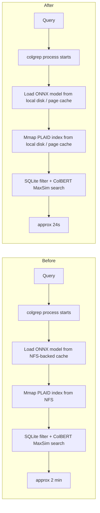
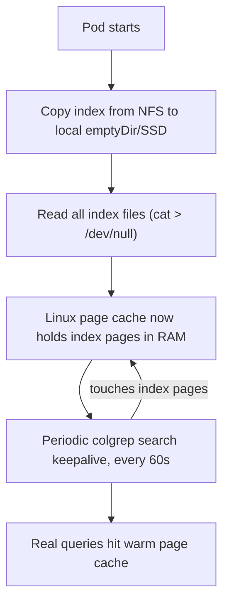

# Colgrep Search Performance Optimization Report

## Executive Summary

Search latency was reduced from approx 2 minutes to approx 20-30 seconds by moving the PLAID index off NFS onto local pod storage and warming the Linux page cache. The remaining latency is attributable to per-invocation overhead: ONNX model loading (1-3s), tree-sitter file scanning, SQLite metadata queries, and ColBERT query encoding (50-200ms) — all of which happen fresh on every `colgrep search` call because colgrep is a stateless CLI tool with no server mode.



## Observed Latency

| Scenario | Latency |
|----------|---------|
| Baseline (NFS) | approx 120s |
| Warmed pod (local + page cache) | approx 24s |
| Practical warm range | 20-30s |

## How Colgrep Search Works Internally

Understanding the internal pipeline explains both why NFS was so punishing and why 20-30s remains after the fix.

### Per-Invocation Pipeline

Every `colgrep search "query"` spawns a fresh process that executes this pipeline:

| Step | What happens | Typical time | I/O pattern |
|------|-------------|-------------|-------------|
| 1. CLI parse | Parse args, canonicalize path | <1ms | negligible |
| 2. Index discovery | Read `project.json`, check parent index | 5ms | small file reads |
| 3. Auto-index check | Hash all source files (xxh3_64), detect changes | 10-100ms | full directory scan |
| 4. Incremental re-index (if changes) | Tree-sitter parse + ColBERT encode changed files | 0.5-5s | read source files, write index |
| 5. **Load ONNX model** | Load LateOn-Code-edge (17M params) via ONNX Runtime | **1-3s** | read 70MB model files |
| 6. **Mmap PLAID index** | Memory-map centroids, codes, residuals, doclens | 1-10ms | mmap syscalls on index dir |
| 7. **SQLite filtering** | Run SQL queries on `filtering.db` for subset selection | 1-20ms | read SQLite pages |
| 8. **ColBERT query encoding** | Tokenize query, run ONNX inference, extract multi-vectors | **50-200ms** | CPU compute |
| 9. **PLAID MaxSim search** | Late-interaction scoring against quantized embeddings | 10-50ms | read mmap'd pages |
| 10. Rank and display | Score boosting, test demotion, syntax highlighting | 1-10ms | read source files for preview |

Steps 5 and 8 are the dominant per-query costs that survive even after fixing I/O. Step 5 is especially significant: the ONNX runtime must load the model weights, compile compute kernels, and allocate inference buffers — every single invocation.

### Index Structure on Disk

The PLAID index directory (stored at `~/.local/share/colgrep/indices/{project}-{hash}/index/`) contains:

```
index/
  metadata.json          # nbits, num_partitions, num_embeddings, num_documents
  centroids.npy          # K-means centroids (num_partitions x 128 floats)
  codes.*.bin            # Product-quantized residual codes (4-bit)
  residuals.*.npy        # Full residuals per chunk
  doclens.*.json         # Embedding count per code unit
  bucket_cutoffs.npy     # Quantization bucket boundaries
  bucket_weights.npy     # Quantization bucket weights
  avg_residual.npy       # Average residual per dimension
  filtering.db           # SQLite: file paths, signatures, code text, call graphs
  embeddings.npy         # Raw embeddings (only for small indexes, <=999 docs)
```

**Typical sizes** for a large project (around 100K code units):

| Component | Size |
|-----------|------|
| Quantized codes + residuals | 5-10 MB |
| Centroids + quantization params | 1-3 MB |
| SQLite filtering.db | 5-15 MB |
| Doclens metadata | 1-2 MB |
| **Total index** | **15-30 MB** |

The ONNX model files (cached under the huggingface hub directory, e.g. `$HOME/.cache/huggingface/hub/models/lightonai/LateOn-Code-edge/`) add another 70MB that must be loaded on each invocation.

### Why NFS Made It So Much Worse

Colgrep uses `mmap` to load the PLAID index. On NFS, every page fault during mmap'd reads triggers a network round trip to the storage server. The search pipeline touches:

1. **ONNX model files** (70MB) — loaded sequentially by ONNX Runtime on startup
2. **Centroids + quantization arrays** — read during search initialization
3. **Codes/residuals** — accessed during MaxSim scoring (random access pattern)
4. **SQLite filtering.db** — B-tree page reads for SQL queries
5. **Source files** — read for result preview and syntax highlighting

On local storage with a warm page cache, most of these are served from RAM. On NFS, each access can incur 0.5-5ms of network latency, and the random access patterns in MaxSim scoring and SQLite queries compound this into minutes of cumulative wait.

## What the Hot-Pod Strategy Does



Three mechanisms work together:

1. **Local replication**: `cp` index from NFS to pod-local storage (emptyDir or hostPath). Eliminates NFS round trips from the query path entirely.

2. **Page cache priming**: Reading the index files forces Linux to cache their pages in RAM. Subsequent `mmap` page faults are served from memory (around 100ns) instead of disk (around 100us) or NFS (0.5-5ms).

3. **Keepalive loop**: A periodic `colgrep search` every 60 seconds touches the hot pages, keeping them "recently used" so the kernel's LRU eviction policy doesn't reclaim them.

### Why the Page Cache Is Not a Guarantee

The Linux page cache is managed by the kernel, not the application. Pages can be evicted under:

- Memory pressure from other pods on the same node
- Large file operations that flood the cache with unrelated pages
- Kernel reclaim decisions based on LRU heuristics

The keepalive mitigates this but doesn't eliminate it. Under heavy node memory pressure, search latency could regress.

## Why 20-30 Seconds Remains

With NFS eliminated and the page cache warm, the remaining latency comes from colgrep's stateless architecture. On every invocation:

| Cost | Source | Why it can't be cached across invocations |
|------|--------|------------------------------------------|
| 1-3s | ONNX model load | Process-private memory; model weights + ONNX Runtime kernel compilation |
| 50-200ms | ColBERT query encoding | Requires initialized ONNX session |
| 10-100ms | File change detection | Scans directory tree, hashes files with xxh3_64 |
| 1-20ms | SQLite open + query | New DB connection per process |
| 10-50ms | PLAID search | Relatively fast once index is mmap'd |

The ONNX model load dominates. The LateOn-Code-edge model (17M parameters, 128-dim ColBERT embeddings) must be deserialized and the ONNX Runtime must compile its compute graph on every invocation. While the ONNX Runtime caches some compiled kernels on disk, it still needs to allocate memory and initialize sessions.

**Colgrep has no server mode or long-lived process mode.** Each search is a fresh `colgrep search` CLI invocation that starts a new process, does all initialization, runs the query, and exits.

## Next Step: Persistent Colgrep Server (To Be Tested)

The remaining 20-30s latency is dominated by per-invocation startup costs (ONNX model load, index mmap setup) that would disappear with a long-running server process. The goal is to load the model and 5GB index once at startup, then serve all queries from that already-initialized state — projecting sub-second latency per query.

This needs hands-on testing before committing to an approach.

## Summary

The hot-pod strategy solved the primary bottleneck — NFS I/O — bringing search from an unusable approx 2 minutes down to a workable 20-30 second range. A persistent server could further reduce latency by eliminating per-invocation startup costs (model loading, index mmap setup, session initialization), saving additional seconds that are significant at this scale.
