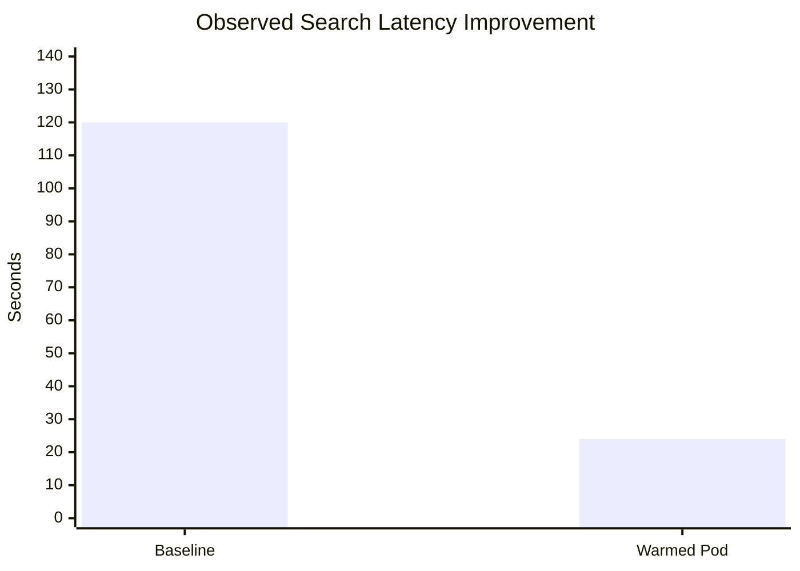
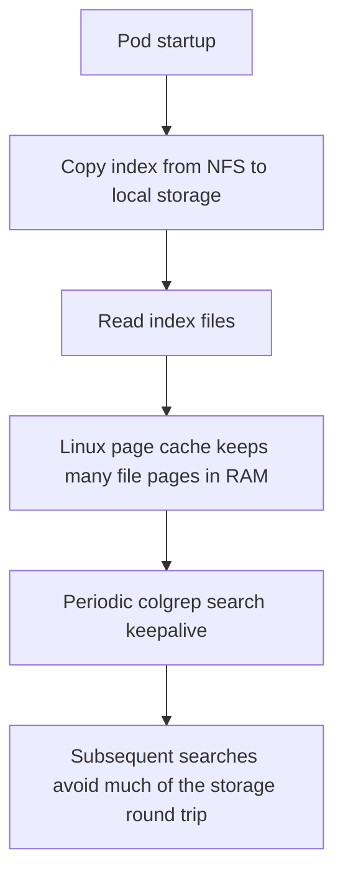
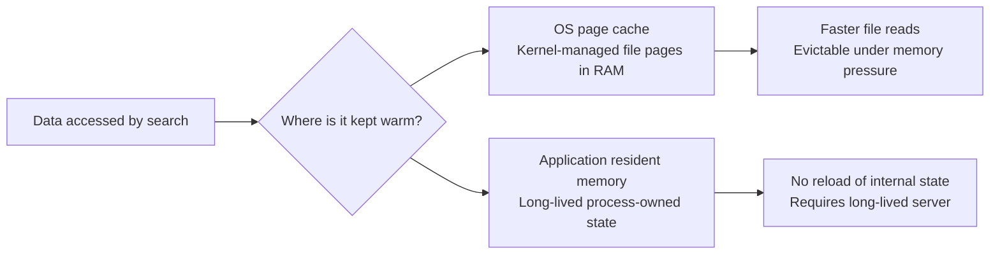
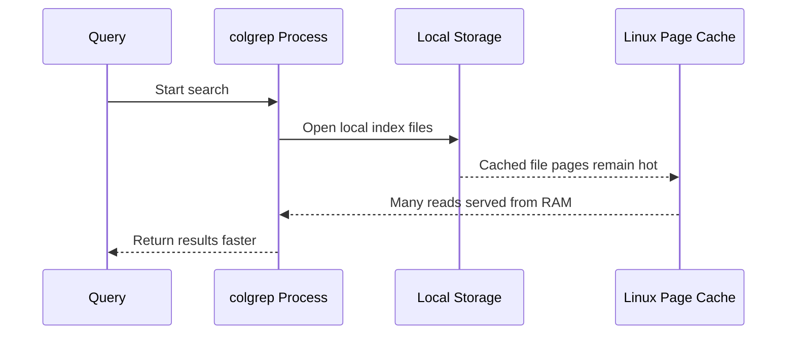
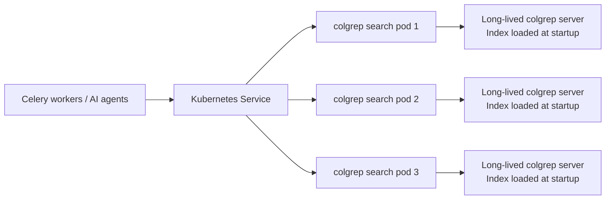

# Colgrep Search Infrastructure — What We Built & Where We Are

---

## Background

The AI coding agent (running in `celery-api` pod) needs to search a 720k-unit monorepo (Siemens Atellica) to answer developer questions. The two tools available are:

- **`rg` (ripgrep)** — exact text/regex search, ~0.5–5s, but requires knowing the exact symbol name
- **`colgrep`** — semantic/natural-language search, returns ranked results by meaning, but slow and inconsistent

---

## Why rg Alone Isn't Enough

`rg` is fast but dumb. If an agent is asked *"how does the reagent thermal control work?"*, `rg` can't help unless you already know the class name is `ThermalsControl` or `ThermalViewModel`. The agent would have to guess keywords, run multiple searches, and still might miss things. Semantic search is the right tool for exploration — `rg` is for confirmation.

---

## The Latency Problem & The Hack

### Problem
Colgrep uses a ColBERT model (`lightonai/LateOn-Code-edge`) and a PLAID index. Cold search (index not loaded in memory) took **5+ minutes** per query — completely unusable.

### Root Cause
Colgrep uses a file lock on the index directory. When a search starts, it acquires the lock, loads the index into memory (~5.7GB), runs the query, then **releases the lock and evicts the index**. The next search starts cold again.

### The Hack: Lock-Hold Keepalive
Instead of fixing colgrep, we exploited the lock mechanism:

- Run a **continuous background loop** of back-to-back colgrep searches (`colgrep search "warmup ping"` with no sleep)
- This keeps the index lock held **99%+ of the time**
- Any real search that comes in hits the "Index is being updated by another process" fast path and returns in **~25 seconds** instead of 5 minutes

This runs as part of the `colgrep-server` pod startup script.

---

## The Rust API Server

The agent (Python, inside `celery-api` pod) couldn't call colgrep directly — it's a CLI tool only available on the `colgrep-server` pod. We built a thin HTTP wrapper:

- **Language**: Rust (Axum 0.7)
- **Endpoints**: `GET /healthz`, `POST /search`
- **Input**: `{"query": "...", "target_paths": ["CH/MMCC/"], "timeout_ms": 120000}`
- **Output**: `{"results": [{"path": "...", "score": 10.2, "start_line": 45, "end_line": 67}], "latency_ms": 26000}`
- **Build**: Compiled as a static musl binary via a K8s Job (`rust:1.78-slim-bookworm`), stored on NFS at `/app/.repos/colgrep-server-api`
- **Deployed**: Runs inside `colgrep-server` pod on port 8080, exposed as ClusterIP Service `colgrep-server:8080`
- **Reachable from**: `celery-api` pod via `http://colgrep-server:8080/search`

The binary parses colgrep's ANSI-escaped CLI output, strips colors, extracts file paths and line numbers, and returns clean JSON.

---

## End-to-End Flow (Current State)

```
Developer question
      ↓
celery-api pod (Python agent)
      ↓  POST /search {"query": "reagent thermal control"}
colgrep-server:8080 (Rust API)
      ↓  spawns: colgrep search "reagent thermal control" /path/to/repo
colgrep-server pod (colgrep CLI)
      ↓  lock already held by keepalive loop → fast path
PLAID index (5.7GB, loaded in RAM)
      ↓  ~25s
JSON results back to agent
```

**Latency**: ~26s end-to-end (down from 5+ minutes)

---

## The Current Problem — Agent Gets 0 Results

Even with the infrastructure working, the agent frequently gets **0 results** from colgrep. Two root causes identified:

### Root Cause A: Files Skipped During Indexing (Encoding) ← PRIMARY ISSUE

During the initial `colgrep init` run on the worktree, colgrep silently skipped a large number of files. These files appear in `state.json` under `ignored_files` — they were **never embedded** and are completely invisible to search.

The most likely reason: the Atellica codebase is old .NET/C++ code — many `.cs`, `.h`, `.cpp` files are encoded in **Windows-1252 or Latin-1**, not UTF-8. Colgrep's file reader does a strict UTF-8 parse and silently drops any file that fails.

Evidence from `state.json` — same directory, different fate:
```
"CH/MMCC/Source/Utils.InstrumentCheck/Procedures/SampleThermalControl.cs"  ← ignored_files (skipped)
"CH/MMCC/Source/Utils.InstrumentCheck/Thermals/ThermalsControl.cs"         ← files (indexed)
```
It's not a whole-directory exclusion — it's file-by-file, determined entirely by which files happened to have non-UTF-8 bytes. The agent has no way to know which specific files are missing.

### Root Cause B: Model Recall Failure on C# UI Code

Even for files that **are** indexed (e.g. `ThermalsControl.cs`), colgrep returns 0 results for queries like *"reagent thermal"* or *"duty cycle"*.

The `lightonai/LateOn-Code-edge` model was trained primarily on low-level systems code (C/C++/Rust patterns). It scores C# WinForms/WPF UI layer code very poorly for domain queries — even when the class name literally contains the search term.

---

## Concrete Evidence: colgrep vs rg on the Same Directory

This was tested live with real queries against `CH/MMCC/Source/`. Results are reproducible.

### Test 1 — Natural language queries (how the agent normally searches)

| Query | Scope | colgrep | rg |
|-------|-------|---------|-----|
| `"reagent compartment thermal handling cooling loop refrigeration setpoint"` | `CH/MMCC/Source/` | **0 results** | — |
| `"reagent tray refrigeration cooler chiller temperature control"` | `CH/MMCC/Source/` | **0 results** | — |

### Test 2 — Exact code-native terms (after the agent already knows the symbol names)

Query sent to colgrep: `"ReagentServer1Thermal TED duty cycle control loop"`
Scope: `CH/MMCC/Source/`
Result: **0 results** (empty `results: []`)

Same terms searched with `rg` in the same directory found:

```
CH/MMCC/Source/Utils.InstrumentCheck/InstrCmds.cs
  → MECHANISM_REAGENT_SERVER_1_THERMAL = "ReagentServer1Thermal"

CH/MMCC/Source/Utils.InstrumentCheck/Thermals/ViewModel/ThermalViewModel.cs
  → MECHANISM_ID.REAGENT_SERVER_1_THERMAL / REAGENT_SERVER_2_THERMAL
  → MECHANISM_COMMAND.REAGENT_SERVER_TED_*

CH/MMCC/Source/Utils.InstrumentCheck/InstrumentState/CCMidVolumeMap.cs
  → ReagentServer1Thermal, ReagentServer2Thermal references

CH/MMCC/Source/Utils.InstrumentCheck/InstrTests.cs
  → REAGENT_SERVER_TED_1_SET_DUTY_CYCLE
  → REAGENT_SERVER_TED_2_SET_DUTY_CYCLE

CH/MMCC/Source/Utils.InstrumentCheck/QuickCheckView.cs
  → MeasureReagentServerSensorsThreadStart() (TED interaction test)
```

### What this proves

Colgrep returned 0 results **even with exact code-native identifiers** scoped to the directory where those identifiers are confirmed to exist. This is not a query phrasing issue — it's a hard failure. Either the files were skipped at index time (Root Cause A), or the model cannot produce a match for these C# identifier patterns (Root Cause B), or both.

The agent has no reliable way to distinguish "these files don't exist" from "colgrep failed to find them". From the agent's perspective, the directory is empty.

---

### Combined Effect

Agent calls colgrep → 0 results → retries 5× with rephrased queries → still 0 → falls back to `rg` with a guessed keyword → may or may not find the right file. From the developer's perspective: the agent wastes 3+ minutes failing before doing something useful, or gives a wrong answer.

---

## What We Tried That Doesn't Fix It

**Prompt engineering** (`prompt.md` updates):
- Colgrep-first rules, retry protocol, tool failure protocol, coverage gap table, repo-wide fallback

**None of this helps** if the files aren't in the index. The agent can't search for something colgrep never embedded. This is a data problem, not a prompt problem.

---

## The Real Fix: Re-Index with Encoding Preprocessing

### What needs to happen

1. **Scan** all files in the worktree, detect non-UTF-8 encoding (`chardet` or `file --mime-encoding`)
2. **Convert** detected files to UTF-8 (`iconv -f windows-1252 -t utf-8`)
3. **Clear** the existing index (`colgrep clear`)
4. **Re-index** (`colgrep init`) — estimated ~8 hours, runs overnight

### Options

| Option | Approach | Risk | Cost |
|--------|----------|------|------|
| A | Convert in-place on worktree, re-index | Git worktree gets modified | ~8h overnight |
| B | Copy worktree to temp dir, convert copy, index copy | Safe, original untouched | ~10GB extra disk + 8h |
| C | Patch colgrep source to do lossy UTF-8 decode instead of hard fail | Clean, permanent | Need to recompile binary |
| D | Leave index as-is, always fall back to `rg` for any 0-result query | No re-index needed | Agent is slower and less accurate |

---

## Infrastructure Files

| File | Purpose |
|------|---------|
| `colgrep-server.yaml` | K8s Deployment + ClusterIP Service for colgrep-server pod |
| `colgrep-api/src/main.rs` | Rust HTTP API wrapping colgrep CLI |
| `colgrep-api-build-job.yaml` | K8s Job to compile Rust binary |
| `prompt.md` | Agent system prompt (colgrep usage rules, coverage gaps) |
| `test-search.sh` | Benchmark script comparing colgrep vs rg latency/results |

## Key Constants

| Item | Value |
|------|-------|
| colgrep-server pod | `colgrep-server-56556b87b-wsdqr` (namespace: `devops`) |
| celery-api pod | `celery-api-6f544f5659-bmwrd` (namespace: `devops`) |
| Index hash | `96a84ddffbffeb5e8fdda97eff0d0d24cc76aa1b-b9246c24` |
| Index location (pod) | `/root/.local/share/colgrep/indices/<hash>/` |
| Index location (NFS) | `/app/.repos/colgrep/indices/<hash>/` |
| Worktree path | `/app/.repos/dhiren/potpie3/worktrees/96a84...` |
| API endpoint | `http://colgrep-server:8080/search` |
| Index size | 5.7GB |
| Search latency (current) | ~25–26s |
| Search latency (before hack) | ~5 minutes |

---

<!-- Original performance analysis below -->


## Executive Summary

The main performance win came from moving the search index off network-attached storage and onto local pod storage, then repeatedly touching that local data so Linux keeps much of it in RAM via the OS page cache.


This changed the search path from:

- remote file access from NFS
- repeated cold reads of large index files
- process startup plus search execution

to:

- local file access inside the pod
- repeated reads served from Linux page cache for many file pages
- process startup plus search execution

In practical terms, that removed a large amount of storage round-trip latency and reduced rough end-to-end search time from about 2 minutes to about 24 seconds, with observed warm behavior in the 20-30 second range.

The current setup is therefore a substantial I/O optimization, but not yet a true always-hot search server. The evidence strongly suggests that repeated `colgrep search` invocations are still paying non-trivial startup, model, or index initialization costs on every query.

## Observed Improvement

Based on the current notes:

- baseline search latency: around 2 minutes
- warmed pod search latency: around 24 seconds
- practical warm range: roughly 20-30 seconds

This is an order-of-magnitude improvement, but still much slower than what would be expected from a fully resident in-memory search service.



## Original Problem: Why Search Was Taking So Long

The original latency was likely dominated by a combination of storage and process-level overhead.

### 1. Index data was being accessed over NFS

When the index lives on NFS, each search can trigger:

- network round trips to fetch index file content
- remote storage latency
- lower throughput than local disk or memory-backed reads
- repeated stalls when large file regions are not already cached close to the compute process

For large semantic-search indexes, this penalty can be severe. Even if the index is not fully reread every time, enough remote reads can accumulate to produce multi-minute latency.

### 2. Searches were likely running from a cold or partially cold state

If `colgrep search` is invoked as a fresh CLI process per request, each run may need to:

- start a new process
- initialize its runtime
- open index files
- reconstruct in-memory search structures
- possibly initialize model-related components

Even after storage gets faster, this repeated startup work still adds significant latency.

### 3. The cost profile was not purely compute

The strongest evidence is the scale of improvement after the hot-pod change.

If the primary issue had been only CPU-bound search logic, copying the index locally and warming file pages would not have reduced latency from around 2 minutes to around 24 seconds. That size of improvement indicates storage access and cold file reads were a major contributor.

## What Was Changed

The current pod behavior does three useful things:

1. Copies the index from NFS to local pod storage.
2. Reads the index files so Linux keeps many of those file pages in RAM.
3. Runs periodic `colgrep search` commands to keep the local working set warm.

This is best understood as a hot-storage or warm-files strategy, not yet a fully hot search-engine strategy.



## How the Current Optimization Works

### Step 1: Copy index from NFS to local storage

This eliminates repeated dependence on remote file access during query execution.

Benefits:

- removes NFS network round trips from the steady-state path
- reduces storage latency variability
- increases read throughput versus remote access
- makes page-cache warming much more effective

This alone is a major architectural improvement because semantic search workloads often touch enough index data that remote storage becomes a bottleneck.

### Step 2: Warm Linux page cache

When the pod reads index files from local storage, Linux stores recently accessed file pages in the OS page cache.

That means later reads often come from RAM instead of disk.

Benefits:

- avoids repeated physical disk reads for hot portions of the index
- reduces read latency from storage-level timings to memory-level timings for cached pages
- lets repeated searches reuse the same cached file data

This is the main reason the current system feels "in memory."

However, it is important to be precise:

- the data is not guaranteed to stay cached forever
- the cache is managed by the kernel, not the application
- pages can be evicted under memory pressure
- the application may still need to reopen files and rebuild internal state each time

### Step 3: Periodic keepalive searches

The periodic `colgrep search` loop helps by continuously touching the local index data so it remains recently used from the kernel's perspective.

That reduces the chance that Linux will evict the relevant file pages and helps maintain warm reads over time.

This is why repeated searches are faster than the original cold path.

## What "Keeping It in Memory" Means Here

There are two distinct memory mechanisms, and they should not be conflated.



### A. OS page cache

This is what the current solution is definitely using.

Characteristics:

- file contents are cached by Linux in RAM after being read
- subsequent file reads can be served from memory
- shared at the node/kernel level
- automatically managed and evictable

This saves the storage round trip, especially the NFS round trip that previously dominated the path.

### B. Application-resident memory

This is the stronger optimization, but it is not yet proven in the current design.

Characteristics:

- one long-lived search process starts once
- index structures are loaded once into that process's memory
- future queries reuse the already-initialized state
- avoids both storage reads and repeated initialization work

This is what a true hot search server would do.

## Why the New Setup Is Faster

The latency reduction is explained by the removal of repeated remote-storage access plus reuse of warmed local file pages.

In effect, the optimization changed the query path like this:

### Before

- query starts
- `colgrep search` process starts
- index data must be accessed from NFS
- remote file reads incur network and storage latency
- search runs
- process exits

### After

- query starts
- `colgrep search` process starts
- index is already present on local storage
- many file reads are satisfied from Linux page cache
- search runs
- process exits

The second path is materially faster because most of the expensive storage round trip has been removed or greatly reduced.



## Why the Current Setup Is Still Taking 20-30 Seconds

The remaining 20-30 second latency strongly suggests that the system is still paying meaningful non-I/O overhead on each search.

The most likely sources are:

- fresh process startup for each `colgrep search`
- repeated opening and scanning of index files
- repeated initialization of model or search structures
- deserialization or reconstruction of internal state on every invocation

If storage reads were the only bottleneck, a fully warmed local pod would be expected to get much closer to near-interactive latency than 20-30 seconds.

That makes the current result easy to interpret:

- the optimization solved much of the storage problem
- it did not eliminate per-query application initialization costs

## Why the 60-Second Keepalive Helps

The keepalive search is a practical cache-maintenance mechanism.

Its function is not to answer business queries directly. Its function is to prevent the hot working set from going cold.

Specifically, it helps by:

- touching the index often enough that Linux continues to treat the relevant pages as recently used
- reducing the chance that infrequent traffic causes file pages to age out of cache
- preserving warm local-read behavior between real searches

This should be described as cache warming, not as a guarantee that the complete semantic-search engine is already loaded and waiting.


## Root Cause Analysis

The most defensible root cause statement is:

> Search latency was dominated by repeated cold access to a large index over NFS, and secondarily by per-invocation startup and initialization overhead inside `colgrep search`.

The evidence for this is:

- moving the index locally and warming it reduced latency dramatically
- the remaining latency is still substantial, indicating that non-storage work remains
- the current loop starts a fresh `colgrep search` process each time instead of reusing one already-loaded search process

## Current Architecture Assessment

The current implementation should be described as:

- local-index replication plus OS cache warming
- not yet a true in-memory query server

That distinction matters for architecture reviews because the current optimization improves latency, but does not provide the same guarantees as a dedicated long-lived search service.

## Limitations of the Current Hot-Pod Approach

### 1. Cache residency is opportunistic

Linux page cache is beneficial but not guaranteed. Under memory pressure, cached pages can be evicted.

### 2. Each search may still pay startup costs

Because the keepalive pattern appears to invoke `colgrep search` as a short-lived process, expensive internal initialization may still happen repeatedly.

### 3. Warmth is file-level, not necessarily engine-level

The data files may be warm while the search engine itself is still cold on every request.

### 4. Scale-out behavior may duplicate warming work

If multiple pods are used, each pod may need its own local copy and its own warmed working set.

## Recommended Way to Report the Improvement

The most accurate report wording is:

> We reduced semantic search latency from roughly 2 minutes to 20-30 seconds by removing repeated NFS reads from the query path. The index is copied to local pod storage and continuously warmed so Linux serves many index reads from memory via the OS page cache instead of remote storage. This avoids the previous storage round trip on most hot reads. The remaining latency indicates that `colgrep` is still incurring process startup and index/model initialization costs per query, so the current system is materially faster but not yet a fully resident in-memory search service.

## Recommended Next Step

To move from 20-30 seconds toward true low-latency search, the next architecture should be:

- one long-lived `colgrep` service process per pod
- load index and model once at process startup
- keep that state resident in process memory
- send all queries to that running process instead of spawning a new CLI process each time

That would eliminate both:

- storage round-trip costs
- repeated per-query initialization costs



## Conclusion

The current optimization succeeded because it attacked the biggest immediate bottleneck: remote index access over NFS. By copying the index locally and warming Linux page cache, the system now serves many reads from memory rather than from remote storage, which explains the drop from about 2 minutes to about 24 seconds.

The current design is therefore correctly described as a warm local-index solution backed by OS cache, not yet a fully in-memory resident search server. That distinction is essential for setting expectations, explaining the observed gain, and defining the next performance milestone.
